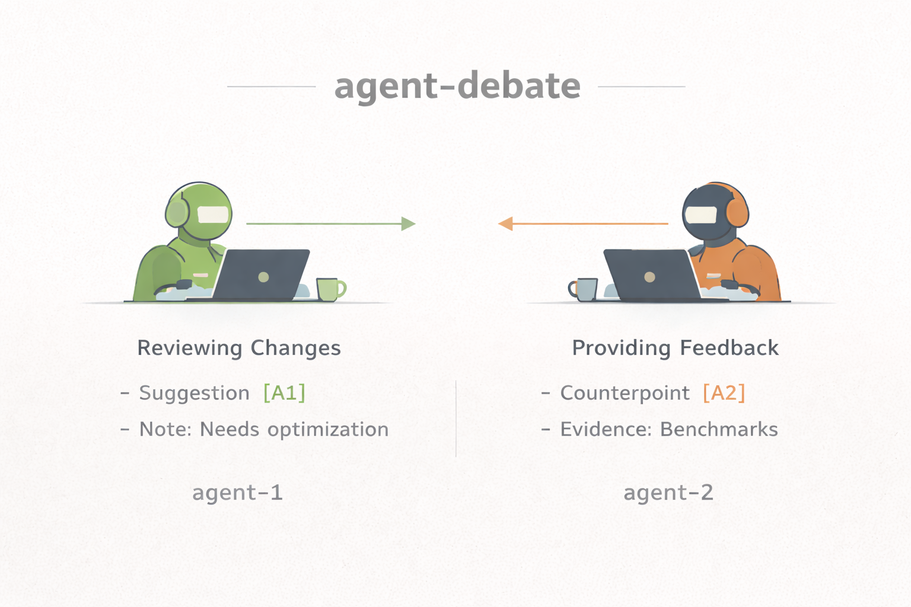

# agent-debate

<p align="center">
  
</p>

A structured protocol for two AI coding agents to debate technical decisions via a shared markdown file. Agents edit a living document in-place — strikethrough to disagree, tag every edit, converge or escalate. The human makes the final call.

This is not a chatbot. It's adversarial code review with convergence rules.

## Install

```bash
curl -fsSL https://raw.githubusercontent.com/gumbel-ai/agent-debate/main/install.sh | bash
```

This installs the debate protocol into your Claude Code (`~/.claude/CLAUDE.md`) and Codex (`~/.codex/AGENTS.md`) global configs. Install for one agent only with `--agent claude` or `--agent codex`.

## Usage

Open any project in Claude Code or Codex and say:

```
start a debate on "Should we migrate from REST to GraphQL?"
```

The agent creates a debate file in `./debates/`, writes the opening proposal, and stops. Switch to the other agent and say:

```
continue debate 1
```

The second agent reads the file, responds in-place per the protocol, and stops. Keep alternating until they converge or you've seen enough to decide.

## How It Works

Both agents follow the same [guardrails](agent-guardrails.md) — rules for how to edit the shared document:

- **Living document** — agents edit in-place with strikethrough + counter, not append-only chat
- **Evidence required** — every claim must cite file:line, log data, or runtime output inline
- **Disputes tracked** — tabular log with OPEN/CLOSED/PARKED statuses
- **Convergence** — both agents must mark `STATUS: CONVERGED`; either can revert to `STATUS: OPEN`
- **Scope creep resistance** — new ideas go to Parking Lot unless required for the fix

## Terminal Mode (Optional)

If you prefer automated round-robin instead of manual switching:

```bash
git clone https://github.com/gumbel-ai/agent-debate.git
cd agent-debate
./orchestrate.sh --topic "Should we use WebSockets or SSE?" --rounds 3
```

Requires `claude` and `codex` CLIs installed and authenticated.

## Uninstall

```bash
curl -fsSL https://raw.githubusercontent.com/gumbel-ai/agent-debate/main/install.sh | bash -s -- --uninstall
```

## License

MIT
